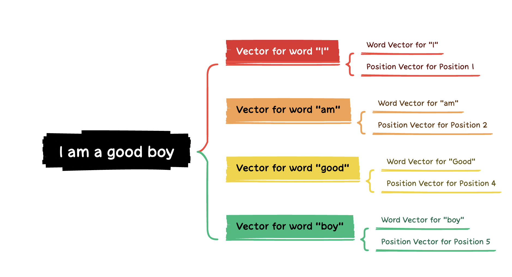
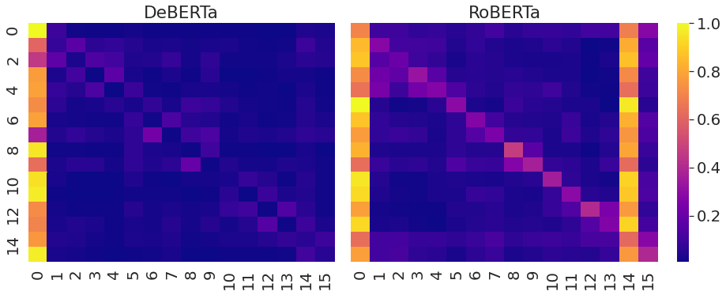
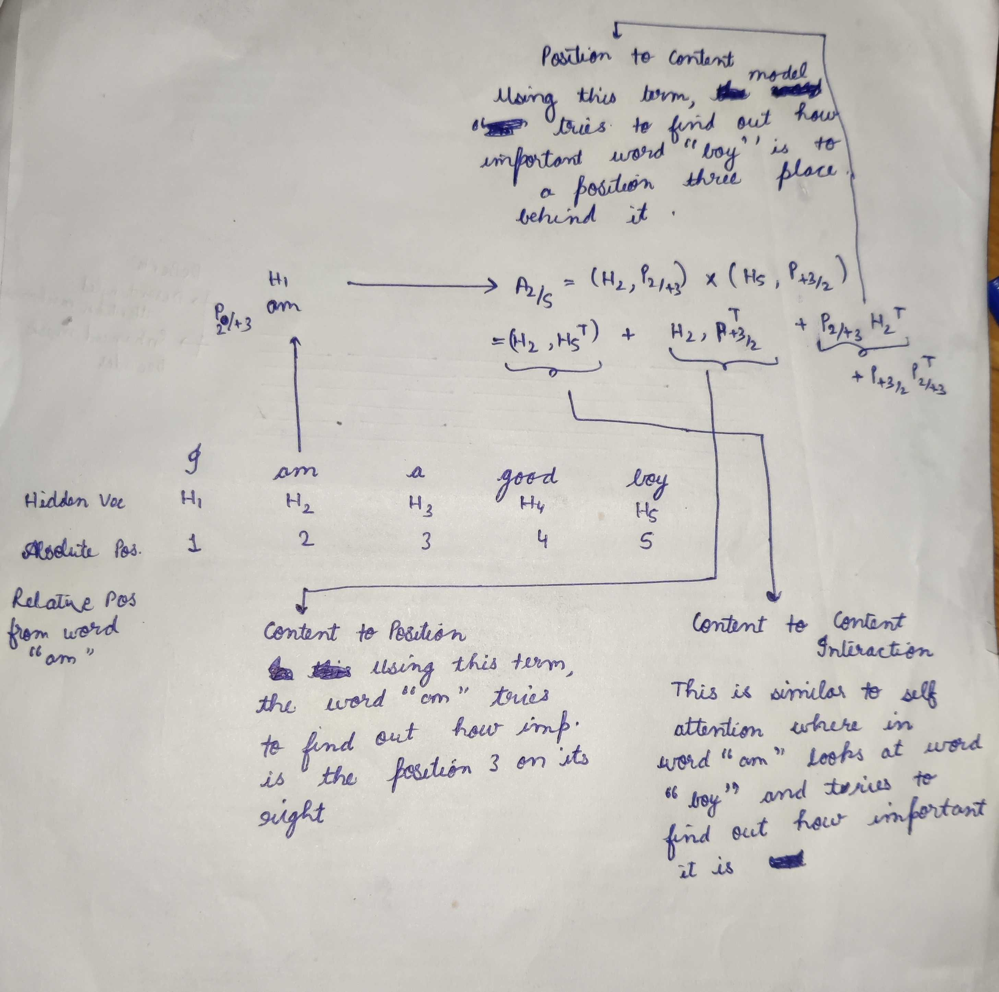

NLP’s State completely changed when in 2018 , researchers from Google open sourced BERT (Bi-Directional Encoder Representation From Transformers) . The whole idea of going from a sequence to sequence transformer model to self-supervised training of just the encoder representation which can be used for downstream tasks such as classification was just mind blowing . Ever since that day efforts have been made to improve such encoder-based models in different ways so as to do better on NLP benchmarks . In 2019 , FacebookAI open-sourced RoBerta which has been ruling as a best performer for all tasks uptill now , but now the throne seems to be shifting towards the new king DeBerta released by Microsoft research in 2022 . Deberta-v3 has beaten Roberta by big margins not only in the recent NLP Kaggle competitions but also on big NLP benchmarks . 

## Introduction

In this article, we will deep dive the [Deberta paper](https://arxiv.org/pdf/2006.03654.pdf)  by Pengcheng He et. al., 2020 and see how it improves over the SOTA Bert and RoBerta . We will also explore the results and techniques to use the model efficiently for downstream tasks. 

DeBerta get its **name** from the two novel techniques it introduces, through which it claims to improve over BERT and RoBerta :

- Disentangled Attention Mechanism
- Enhanced Mask Decoder

**Decoding-enhanced BERT with disentangled attention** (DeBerta) 

Now to understand the above techniques , the first step is to understand how Roberta and other encoder-type network work , let’s call this context and discuss it in the next section

## Getting some Context

In this section we will discuss the working and flow of three key techniques that Transformer based models introduced ➖

### Positional Encoding

A Transformer-based model is composed of stacked Transformer Encoder Blocks. Each Block contains a multi-head self-attention layer followed by a fully connected positional feed-forward network . Introduction of feed forward neural network instead of Sequential RNN’s allowed for parallel execution of model but since they are not sequential , they were not able to incorporate the positional information of words (i.e which word belonged to which position) . In order to tackle this , the authors introduced the concept of Positional Encodings wherein they introduced positional vectors in addition to the word vectors and added them together to get the final vector representation for every word . Let us understand this through an example shown in the figure below

    Figure 1 : Embedding in Transformers

In our example sentence “I am a good boy” , we assume the tokenisation to take place at word level for simplicity sake . So after tokenisation we will have the tokens as [ I , am , a , good , boy ] and their respective positions as [1 , 2, 3, 4, 5] . Now before sending out the tokens into the transfomer we convert them into vectors of certain dimension like we did for LSTM’s , but here the vector for each token is a sum of its word vector and position vector , so for token “I” the final vector will be (word_vector_of_i + position_vector_of_position_one) and similarly for all other tokens . Now the obtained vector is represented by a vector whose value depends on its content and position. Then the transformer while training is able to understand the position of the word by certain series of activations .

In the DeBerta paper , the authors argue that adding position embedding and word embedding together is not ideal because the positions are too much mixed with the signal of the content of the word . Thus it introduces a noise which leads to a lower performance and hence they propose Disentangled Attention mechanism in which they use two separate vectors for content and position and calculate attention using disentangled matrices using both vectors

### Multi-Headed Self Attention

A standard self attention works by computing for every word from the input text an attention weight which gauges the influence each word has on another word . This attention mechanism uses an embedding vector which has position and context information mixed together which helps in understanding the absolute positions of the words . Each of the tokens in the input text produce Query(Qi’s) and Key (Ki’s) vectors , whose inner product then result in Attention Vector (Ai’s) . When we combine all queries and keys we get the Query Matrix and the Key matrix , there inner product gives us the attention matrix , where $Aij$ in Attention matrix represents the attention weight of  $token_j$ on $token_i$ which guages the influence of $token_j$ on $token_i$

However the self attention is not capable of naturally gauging the relative positions of the words . This is where the positional encoding comes in .Then we have multiple heads instead of a single head doing the same thing but on different part of the embeddings thereby allowing for learning of different representation of the same word . 

In the DeBerta paper , the author claim that this is also not ideal and both positions and contents should have separate signals.

### Masked Language Based Self Supervised PreTraining

With the Bert paper , authors came out with a self supervised pre-training technique that revolutionized NLP **.** They showed that a transformer model’s encoder can be trained using a Masked Language modelling Objective ( An Objective where in 15 percent of the tokens in an input sentence is masked and the model has to predict the masked tokens ) and Next Sentence Prediction to incorporate the knowledge of a Language and that pretrained model can be used for downstream tasks for that Language .

## The Components of DeBerta

Now that we have context of how the competitors work and its shortcomings, we can now dive deep into how DeBerta works and improves upon on the shortcomings of its predecessor. 

### Disentangled Attention Mechanism

Unlike BERT where each word in the input layer is represented using a vector which is the sum of its word embedding and position embedding , in DeBerta each word is represented using two vectors that encode its content and position respectively and the attention weights among words are computed using disentangled matrices. This is motivated by the observation that the attention weight of a word pair not only depends on there contents but their relative positions as well.

In BERT as explained above , every token produced a single Query and a Key vector and their inner product gave us the attention weights . Since every token there was presented by a single vector (H) the equation looked like :

$Q=HW_q,K=HW_k,V=HW_v,A=\frac{QK^T}{\sqrt{d}},H_o = softmax(A)V$ , 

where H represents the Hidden state or the embedding matrix for the whole input , $W_q$  represents a linear projection matrices for Query and key respectively and $A$ represents the Attention Matrix and $H_o$ the output of self-attention

**In Deberta** for a token at position $i$ in a sequence, it is represented using two vectors, ${H_i}$ and $P_{i|j}$ , which represent its content and its relative position with respect to the token $j$ . Let’s go back to our example in order to understand this better , In our example “I am a good boy” , if we have to calculate of how $token_2$ (”am”) attends to $token_5$ (”boy”) , we will first get two vectors from $token_2, H_2$ (word Vector for “am”) and $P_{2|+3}$ (Because Relative Position Vector of token Position 2 with respect to Position 5 is +3) . Let’s look at the picture below to understand better .

General Equation :
$A_{i,j} = (H_i,P_{i,j})*(H_j,P_{j,i}) = H_i,H_j^T + H_i,P_{j,i}^T + P_{i,j}H_j^T + P_{i,j}*P_{j,i}^T$     where $A_{i,j}$ is Attention weight for $token_j$ when looking from $token_i$

This new Disentangled Attention is a sum of four components whereas previously in BERT and Roberta it used to be single term $H_i * H_j^T$ . Thus this mechanism is able to capture much more information than the standard self attention , Let’s look at the components

- Content to Content
- Content to Position
- Position to Content
- Position to Position

**Content to Content** is similar to standard self attention , where each word looks at all the different words in the input text and try to gauge its importance on itself .

**Content to Position** term can be interpreted as $token_i$ (”am” in our case) trying to find out which position around it is important to look at and from which position around it should request more information than others. *For Eg*: Let’s say the model has figured out already that “I” should come before “am” , thus now for token “am” , the information about “I” is not much useful now , using this term in attention , the word “am” can decide since I already the word before me will “I” thus I want to look at the words after myself.

**Position to Content** term can be interpreted as $token_i$ saying , I am at position $i$ , which words should I look at in the input sentence wrt this position $i$ so that I can be better at predicting masked tokens

**Position to Position** term is not that useful because we are talking about relative positions 

<aside>
💡 One thing to Note here is that while the hidden layer embeddings change every layer , the relative positional embeddings remains the same and is taken the same at the every layer . Also the Relative Positions are clipped and only exists till +- k wrt some position

</aside>

Thus in this way ,By feeding in relative position information at each step and keeping it separate from context information, DeBerta is able to gather more information about the words as well as their relative positions . 

### Enchanced Mask Decoding

DeBERTa is pretrained using MLM similar to RoBERTa and BERT , where a model is trained to predict the randomly masked words in a sentence using the context from surrounding words . Since DeBERTa uses relative positions instead of Absolute positions of words , it is not able to efficiently transfer the context for the masked word prediction in some cases . For Eg : Given a sentence “a new **store** opened beside the new **mall**” with the words “**store**” and “**mall**” masked for prediction. Using only the local context (eg, relative positions and surrounding words) is insufficient for the model to distinguish between *store* and *mall* in this sentence , since both follow the word new with the same relative positions thus giving thereby giving the same context information about to two different words. To address this limitation , the model needs to take into account the absolute positions in addition to the relative positions , In order to do that the absolute positions information is added right after the transformer layers just before the softmax layer for masked token predictions . This is what they call as ***Enhanced Mask Decoding .*** The authors argue that in this way DeBERTa captures the relative positions in all the Transformer layers and only uses absolute positions as complementary information when decoding masked words. They also compare EMD with BERT’s architecture (where absolute positions are input at the first layer only) and observe that EMD works much better . They conjecture that the early incorporation of absolute positions used by BERT might undesirably hamper the model from learning sufficient information of relative positions . 

## Scale Invariant FineTuning

In addition to some major component changes DeBERTa authors also pretrain the model using a new adversarial training algorithm , Scale Invariant FineTuning (SiFT) . 

Virtual Adversarial Training is a regularization method for improving models’ generalization. It does so by improving a model’s robustness to adversarial examples( examples which are completely different from training distribution) which are created by making small perturbations to the input . The model is regularized so that when given a task-specific example the model produces the same output distribution as it produces on an adversarial perturbation of that example .

The author propose SiFT that improves the training stability by applying the perturbations to the normalized word embeddings . Specifically when fine-tuning DeBERTa to a downstream NLP task , SiFT first normalizes the word embedding vectors into stochastic vectors and then applies the perturbations to the normalized embeddings vectors , this substaintially improves the performance of the fine-tuned models . 

## Conculsion

This Paper presents a new Transformer Based Architecture DeBERTa which introduces two new novel parts which helps to improve significantly over RoBERTa and BERT on almost every NLP Task . DeBERTa has seen rising popularity over the coming year and new versions applying different pretraining techniques have been released by Microsoft as well . DeBERTa surpassing human performance on SuperGLUE marks an important milestone toward General AI , there much more improvements to come to this model.

I tried to explain the components in as easy terms as possible , If you have enjoyed the blog, I will recommend reading the original paper.